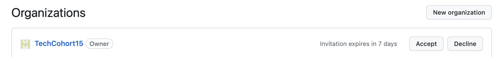

# Clone Team Web Site
For our team project we will work on a website that will NOT be publicly available. It will only run locally on your invidual machines.  

This repository will be a simple web page that everyone will make their contribution. Contributions will be limited to adding personal info to the website. Please note that letters in between greater than and less than ( `<example>` ) are examples and `%` is the Terminal prompt and not part of the Git commands.  

### GitHub Organizations:
GitHub has a ton of features and will try to get the main ones during this course. One of those features is [organizations](https://docs.github.com/en/organizations/collaborating-with-groups-in-organizations/about-organizations). Organizations serve as a container for your shared work and gives the work a unique name and brand. It also offers addtional features that you will access later on (i.e. project board, apps, etc.). You belong to an organization here at NFAR: TechCohort# (# is your cohort number). After you log in to GitHub click on the upper right icon and a menu will appear. From that menu click on "Your organizations". After you navigate you will see a that you were invited to join the TechCohort# organization (see below). Click on "Accept".     

 

You are part of a GitHub organization now! After you accept you can click on the organization name and it will navigate to the organization's page. Towards the top you will see Repositories. Click on it and it will take you to the list of repositories available to this organization.

 
### 1. In Terminal, navigate to your work folder:
You should have created a working folder earlier while reviewing terminal commands: 
```
%cd <yourFolder> 
```
### 2. Clone the repository: 
You can get the clone address by navigating to the repository in a web browser and clicking on the green "<>Code" button and copying the HTTPS URL address: 

  
 In Terminal, clone the GitTechWebsite# repository using the copied URL: 
 Remember to subtitute the # with your Cohort number.

```
% git clone https://github.com/TechCohort#/GitTechWebsite#.git
```
This will clone the repository and create a folder inside your working folder with the repository name. At this point you can move into the repository folder you created:

```
%cd GitTechWebsite#
```

### 3.  Create a branch for your changes:  
Once you have a clone of the repository you will be on the main/master branch. Best practice is to NOT make changes to the main/master branch. Why is it so important to not make changes to the main branch? One word: deployable. It is your production code, ready to roll out into the world. The master/main branch is meant to be stable, and it is the social contract of open source software to never, ever push anything to master that is not tested, or that breaks the build. The entire reason GitHub works is that it is always safe to work from the master.
 
Now that the importance of the main/master branch is established, let's create a branch to work in. Projects will have naming conventions for files, folder, branches (i.e. by issue, by feature, hotfix, ticket number, etc.), and coding. For our project, when creating a branch, make sure to follow this naming convention for branches: firstnameFeature   <br>

First name is lowercase, the first letter of the "Feature" is uppercase. Suppose team member Ryan is working on updating the picture; then the branch name would be: <br>
 _ryanPicture_ 
 
```
%git checkout -b <firstnameFeature> 
```


The `%git checkout -b` is doing TWO commands at once and is good practice. It is creating a branch **AND** checking it out with option `-b`. 

To just create a branch you can use the following command: `git branch <branchName>`. However, you will have to remember to checkout the new branch. Otherwise, you will be making changes to the main/master branch, which means you would be breaking the social contract! To avoid this painful mistake of forgetting to switch to a newly created branch when creating a new branch just use: <br> `%git checkout -b`
 
To just switch to a branch use: `git checkout <branchName>`. We will use this later on. 
 
### 4. Check branch status: 
Always check to see what branch you are on. To check to see what branch you are working on enter the following command in Terminal:  
 
```
%git status 
```
   
 
If after you check the status you notice you are not on correct branch, STOP! To checkout (switch) to the correct branch enter the following: <br>
 
```
%git checkout <yourfirstnameFeature> 
```
Check your status again. This my seem repetitive, but when first starting to work with branches, many developers forget to switch to the newly created branch. If you don't change to the correct branch you will be making changes to the main/master branch and your changes will NOT be accepted. Essentially, you will have lost your changes 😢.  

### 5. Now you can push this branch up to GitHub:
Let's make sure that we push this branch to GitHub (there are no updates or changes at this point). Remember, this branch is only located on your local computer. You have to "push" the local branch up the remote repository. Only after you have pushed the local branch can you create a pull request to have our changes merged to the main/master repository later on. 

```
%git push –u origin <branch name> 
```

Got an error message? 
### 6. Check that the branch has been successfully pushed up. To confirm that the branch has been pushed, head over to GitHub and click the "branches" drop-down. You should see the branch there: 


Now that you have a local branch will  and have it showing up remotely you can contribute your assigned changes to the website.  


### [Next - Step 5: Changes to Website:](5_MakeChangesToWebsite.md)

